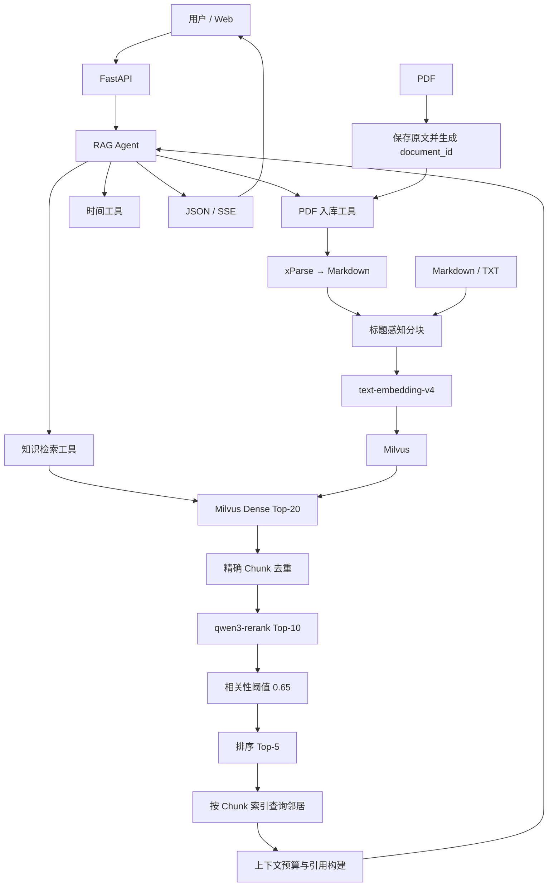

# AVF Research Assistant

> 面向科研文献的智能检索与问答 RAG Agent 平台

AVF Research Assistant 面向动静脉瘘（Arteriovenous Fistula，AVF）科研、教学和算法验证场景。系统支持 PDF、Markdown 和 TXT 文献入库，由 Agent 调用知识检索工具，通过 Milvus Dense 召回、DashScope 专用 Rerank、索引邻居扩展和上下文预算控制生成带来源引用的回答。

> 使用边界：系统输出不构成临床诊断或治疗建议，不能替代医生或专业医疗人员的判断。

## 核心能力

- **工具调用 Agent**：基于 LangChain `create_agent`、LangGraph Checkpointer 和通义千问构建单 Agent 工作流，支持知识检索、PDF 入库、入库状态查询和时间查询。
- **多格式文献入库**：MD/TXT 上传后直接分块并索引；PDF 上传后先登记原文，再由 Agent 显式提交 xParse 异步解析与索引任务。
- **两阶段检索**：Dense Top-20 召回，经过精确 Chunk 去重、一次性 `qwen3-rerank` 专用精排 Top-10、相关性阈值、Top-5 选择和基于 `source_id + chunk_index` 的相邻 Chunk 扩展后构建上下文。Rerank 超时、异常、HTTP失败或结果不完整时降级为向量排序，不会误套 Rerank 阈值。
- **稳定证据标识**：新入库数据使用 `{document_id}:{sha256(content)[:16]}` 作为逻辑 `chunk_id`，并保存 `source_id`、`chunk_index` 和 `content_hash`。
- **可追溯回答**：上下文包含证据、章节、作者—年份引用和来源文件；检索 Artifact 可供前端、日志和评测复用。
- **流式与会话**：FastAPI 提供普通问答和 SSE 流式问答，`MemorySaver` 按 `session_id` 保存进程内多轮上下文。
- **可重复评测**：保留25题论文级检索消融实验，并新增50题、真实 Milvus Chunk ID 的 Agent 全链路评测与 BL-1 基线评测入口。
- **可降级启动**：导入应用不会连接外部服务；Milvus、Embedding、VectorStore和Agent由FastAPI lifespan统一管理，知识库不可用时健康检查和问答入口明确返回503。
- **基础安全边界**：公开API不接受任意服务器目录路径；Markdown渲染经过DOMPurify；默认CORS仅允许本地同源入口，并对问答长度、上传大小和并发进行服务端限制。
- **日志脱敏**：科研问题和会话ID不写入日志正文，仅记录字符长度、SHA-256短哈希和HTTP Request ID；生产模式关闭Loguru变量诊断输出。

MCP客户端代码仅作为 `experimental` 扩展样例保留。当前生产Agent不导入该模块、未配置MCP服务器、也没有注册MCP工具，因此本项目不声称MCP已经落地；本轮不接入PubMed MCP。

## 系统架构



## 处理流程

### 问答链路

```text
用户问题
  → Agent 判断是否调用知识检索工具
  → Milvus Dense Top-20 召回
  → chunk_id / content_hash / 正文精确去重
  → 20个候选一次性 qwen3-rerank，保留 Top-10
  → 0.65 相关性阈值过滤
  → 排序选择 Top-5（不执行来源多样性扩张）
  → 对Top-3高分证据按 source_id + chunk_index 查询相邻Chunk
  → 在12,000字符预算内构建引用上下文
  → Agent 基于证据生成回答
  → JSON或SSE返回
```

### 文献入库链路

MD/TXT：

```text
上传文件 → UTF-8读取 → 标题/字符分块 → Embedding → Milvus
```

PDF：

```text
上传PDF
  → 文件头与大小校验
  → 保存 uploads/originals/{document_id}/
  → 返回 uploaded（此时尚未入库）
  → 用户明确要求后，Agent提交后台任务
  → queued → parsing → parsed → splitting → embedding → indexed
  → 任务状态保存到 uploads/jobs/{job_id}.json
```

PDF 只有在状态为 `indexed` 时才可视为已进入知识库。

## 当前检索配置

| 参数 | 默认值 | 说明 |
|---|---:|---|
| `RAG_CANDIDATE_K` | 20 | Dense 召回候选数，也是单次 Rerank 输入上限 |
| `RAG_RERANK_K` | 10 | 单次专用 Rerank 后保留数；失败时向量排序也保留此数量 |
| `RAG_RERANK_MODEL` | qwen3-rerank | DashScope 专用文本重排模型 |
| `RAG_RERANK_TIMEOUT_SECONDS` | 30 | 专用 Rerank 调用超时；超时后回退向量排序 |
| `RAG_RERANK_THRESHOLD` | 0.65 | 进入最终选择的最低 Rerank 分数 |
| `RAG_FINAL_CHUNKS` | 5 | 阈值过滤后选择的基础证据 Top-K；邻居另行扩展 |
| `RAG_THRESHOLD_FALLBACK_K` | 3 | 真实 Rerank 全部低于阈值时的保底数量 |
| `RAG_MAX_CONTEXT_CHARS` | 12000 | 最终上下文字符预算 |
| `RAG_MAX_CHARS_PER_EVIDENCE` | 1600 | 预算不足时单条证据的截断上限 |
| `CHUNK_MAX_SIZE` | 1600 | 基础配置；当前二次字符分割器实际使用其2倍 |
| `CHUNK_OVERLAP` | 200 | 字符分割重叠量 |

注意：当前 `DocumentSplitterService` 的递归分割器使用 `chunk_size * 2`，所以配置1600时实际二次分割目标上限约为3200字符；`RAG_MAX_CHARS_PER_EVIDENCE` 也不是对所有完整证据强制截断，只有完整证据无法放入剩余总预算时才应用。

## 评测结果

当前语料为66篇文献、1,284个Chunk，已完成统一重建、书目去重、元数据和`chunk_index`连续性审计。

正式评测使用同一份50题人工审核多Gold Chunk数据集。生产Reranker替换为DashScope `qwen3-rerank` 后，完整Agent链路结果如下：

| 指标 | BL-1 Dense Top-5 | Full | Full提升 |
|---|---:|---:|---:|
| Recall@3 | 46% | 88% | +42个百分点 |
| Recall@5 | 56% | 88% | +32个百分点 |
| MRR | 0.3797 | 0.8067 | +0.4270 |
| Doc-Hit@5 | 88% | 100% | +12个百分点 |
| Faithfulness | 0.8916 | 0.9382 | +0.0466 |
| Context Recall | 0.7850 | 0.9650 | +0.1800 |

Full共50/50题有效，工具调用合规率100%、空回答率0%、Rerank降级0次。结果目录为`evaluation/results/FULL_QWEN3_V2_20260723_FORMAL/`；详细口径和历史边界见[evaluation/README.md](evaluation/README.md)。

## 技术栈

| 层级 | 技术 |
|---|---|
| API | FastAPI、Uvicorn、SSE |
| Agent | LangChain、LangGraph、ChatQwen |
| LLM / Rerank / Embedding | 通义千问 `qwen-max`、DashScope `qwen3-rerank`、`text-embedding-v4` |
| 文献解析 | xParse CLI |
| 向量数据库 | Milvus 2.5、MinIO、etcd、Attu |
| 评测 | Ragas、自定义ID命中指标、pytest |
| 部署 | Docker Compose、Windows启动脚本 |

## 项目结构

```text
app/
├── agent/                      # experimental MCP客户端（默认不加载）
├── api/                        # chat、file、health路由
├── core/                       # LLM与Milvus连接
├── models/                     # 请求、响应、PDF任务模型
├── services/
│   ├── retrieval/              # recall、rerank、neighbor expansion、context builder
│   ├── pdf_ingestion_service.py
│   ├── xparse_parser_service.py
│   ├── document_splitter_service.py
│   ├── vector_index_service.py
│   └── rag_agent_service.py
└── tools/                      # 知识检索、PDF入库、时间工具

evaluation/                     # 当前评测、结果与archive历史说明
docs/                           # 当前设计、成果材料与archive历史文档
scripts/                        # PDF批量辅助脚本
static/                         # 原生Web界面
uploads/                        # 本地原文、解析结果和任务状态（不提交Git）
volumes/                        # Milvus持久化数据（不提交Git）
```

## 快速开始

### 1. 环境要求

- Python 3.11～3.13
- Docker Desktop
- DashScope API Key
- xParse CLI（仅PDF解析需要）

### 2. 安装

```powershell
Copy-Item .env.example .env
python -m venv .venv
.venv\Scripts\python.exe -m pip install -e .
```

在 `.env` 中设置：

```dotenv
DASHSCOPE_API_KEY=your-real-api-key
```

### 3. 启动

Windows推荐且唯一的一键启动入口如下。脚本始终使用项目内 `.venv`，并以脚本所在目录作为项目根，不依赖当前工作目录。

```powershell
.\start-windows.bat
```

开发时也可手动执行同一Python入口：

```powershell
docker compose -f vector-database.yml up -d etcd minio standalone
.venv\Scripts\python.exe run_server.py
```

| 地址 | 用途 |
|---|---|
| <http://localhost:9900> | Web界面 |
| <http://localhost:9900/docs> | Swagger |
| <http://localhost:9900/health> | 健康检查 |
| <http://localhost:8000> | Attu（单独启动后） |

## API

| 方法 | 路径 | 功能 |
|---|---|---|
| `GET` | `/health` | 核心服务及Milvus、DashScope配置、xParse CLI和MCP启用状态 |
| `POST` | `/api/chat` | 非流式Agent问答 |
| `POST` | `/api/chat_stream` | SSE流式Agent问答 |
| `POST` | `/api/chat/clear` | 清空会话 |
| `GET` | `/api/chat/session/{session_id}` | 查询会话历史 |
| `POST` | `/api/upload` | 上传PDF/MD/TXT；PDF仅登记，MD/TXT直接索引 |

PDF解析和入库由 Agent 工具触发，不存在独立的公开PDF入库HTTP路由。

## 运行评测

文档导航见[docs/README.md](docs/README.md)，评测说明见[evaluation/README.md](evaluation/README.md)。正式50题全链路使用：

```powershell
python evaluation/evaluate_review.py --output evaluation/results/{run_name}
```

完整 BL-1 使用：

```powershell
python evaluation/evaluate_bl1.py --output evaluation/results/{run_name}
```

两套评测都会调用 Milvus、生成模型和 Ragas 评判模型，不应并行运行。运行前应确认外部调用成本；建议先使用 `--limit 3` 冒烟验证，3题结果不得作为正式基线。

## 数据与安全

- 不提交 `.env`、`uploads/`、`volumes/`。
- 仓库不包含受版权保护的论文原文和本地Milvus数据。
- 不将评测集自动生成的证据摘要冒充人工医学结论。
- 不将系统输出用于临床决策。
- 生产部署必须在 `.env` 中将 `CORS_ALLOWED_ORIGINS` 改为实际前端来源。
- 当前已关闭公开目录索引并增加基础请求限制，但认证、会话授权、用户级限流和费用配额尚未实现，不能直接暴露到公网。

## 已知限制

- 专用Reranker读取完整Chunk正文；外部API失败、超时、空结果或部分结果时整次回退到向量Top-10。
- 66篇当前语料已于2026-07-22统一重建并完成书目去重，具备真实 `chunk_index`；后续新增或外部恢复的旧格式数据仍需通过审计确认。
- 当前分块配置1600实际对应约3200字符的二次分割上限。
- 新评测脚本已过滤非有限Ragas分数并保存完整回答与上下文；重建前历史结果因原始数据截断仍无法无损修复。
- Query Rewrite、Multi-query和混合检索尚未实现；对应空配置和未生效的 `source_filter` 参数已删除。
- 公开检索工具固定使用20候选、Rerank Top-10和最终Top-5；不再公开无差异的auto/focused/broad模式、来源上限或伪token预算参数。

## License

仓库当前未提供独立 `LICENSE` 文件。在明确开源许可证之前，默认保留所有权利。
