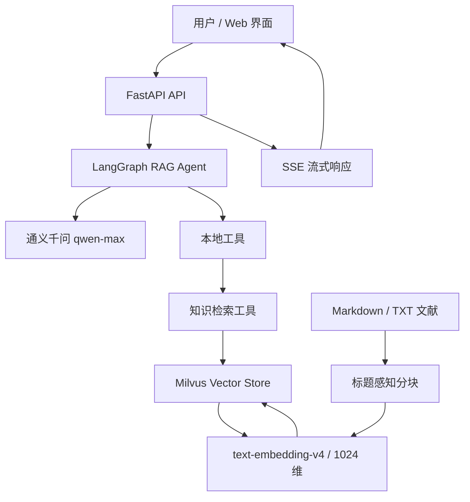

# AVF Research Assistant

> 面向动静脉瘘（Arteriovenous Fistula, AVF）科研与教学场景的 RAG 文献检索和智能问答系统

[](https://www.python.org/)
[](https://fastapi.tiangolo.com/)
[](https://www.langchain.com/langgraph)
[](https://milvus.io/)
[](evaluation/README.md)

AVF Research Assistant 是一个围绕 AVF 狭窄、血流声音、血流动力学和深度学习研究构建的医学科研文献助手。系统将论文转换为向量知识库，由 LangGraph Agent 调用检索工具，再使用通义千问基于论文内容生成带来源引用的回答。

> **使用声明**：本平台生成的内容仅用于科研、教学和算法验证，不构成临床诊断意见，也不能替代医生或专业医疗人员的判断。

## 项目亮点

- **完整 RAG 链路**：文献上传、标题感知分块、向量化、Milvus 存储、语义检索和回答生成。
- **工具调用 Agent**：基于 LangGraph 和 ChatQwen 构建单 Agent，通过知识检索和时间工具完成任务。
- **论文级检索去重**：先召回 Top-15 分片，再按论文来源去重，减少同一论文占据多个结果位置。
- **流式交互**：FastAPI 提供 REST API，前端通过 SSE 实时渲染模型回答。
- **多轮会话**：使用 LangGraph `MemorySaver` 按 `session_id` 保存对话上下文。
- **可量化评测**：提供知识库盘点、Hit@K、Recall@K、去重对比、引用核验、TTFT 和索引性能评测脚本。
- **可追溯引用**：根据论文文件名生成 `(Author et al. Year)` 引用标签，并将检索来源传递给 Agent。

## 真实评测结果

以下结果来自 2026-07-15 的实际运行，详细明细见 [EVALUATION_RESULTS.md](evaluation/results/EVALUATION_RESULTS.md)。评测使用中文学术问题，不代表临床有效性，也不代表知识库更新后的永久表现。

### 知识库快照

| 指标 | 结果 |
|---|---:|
| Milvus 入库论文来源 | 30 篇 |
| 文本分片 | 308 个 |
| 平均分片数 | 10.3 个/篇 |
| 平均分片长度 | 4,474 字符 |
| 嵌入模型 | text-embedding-v4（1024 维） |

### 检索效果

评测集包含 **25 道人工标注问题、10 个科研子方向和 93 条相关论文标注**。

| 指标 | @1 | @3 | @5 | @10 |
|---|---:|---:|---:|---:|
| Hit@K | 52.0% | 72.0% | 76.0% | 84.0% |
| Recall@K | 16.9% | 34.9% | 42.5% | 62.1% |

`Hit@5 = 76%` 表示 25 道问题中有 19 道在前 5 个结果中至少找到了一篇人工标注的相关论文。

### 论文级去重优化

对比“直接返回 Top-5 分片”和“Top-15 候选分片召回后按论文去重”：

| 指标 | 基线 | 论文级去重 | 变化 |
|---|---:|---:|---:|
| Top-5 平均来源覆盖数 | 3.00 篇 | 4.76 篇 | +58.7% |
| 重复来源占比 | 40.0% | 4.8% | -35.2 个百分点 |
| Hit@5 | 76.0% | 88.0% | +12.0 个百分点 |
| Recall@5 | 42.5% | 62.1% | +19.6 个百分点 |

### 当前评测边界

- 引用有效率和人工引用支持率尚未执行正式批量评测；
- SSE 的 TTFT 和完整响应时间尚未执行正式批量评测；
- 索引性能目前只完成 dry-run 分块统计，未将 dry-run 时间描述为完整索引耗时；
- 检索评测直接调用向量存储，不包含 Agent 是否调用工具和如何改写查询的影响；
- GitHub 仓库不包含本地论文原文和 Milvus 持久化数据。

## 系统架构



### 问答数据流

```text
用户问题
  → FastAPI 接收请求
  → LangGraph Agent 理解任务
  → 调用知识检索工具
  → 查询向量化并检索 Top-15 候选分片
  → 按论文来源去重，保留 Top-5 论文
  → 将论文片段和引用标签交给通义千问
  → 通过普通 JSON 或 SSE 返回回答
```

### 文献入库数据流

```text
上传 .md/.txt
  → 校验类型和大小
  → 保存至 uploads/
  → 按 Markdown 标题和字符长度分块
  → DashScope Embedding 生成 1024 维向量
  → 写入 Milvus biz collection
```

## 技术栈

| 层级 | 技术 | 用途 |
|---|---|---|
| 后端 API | FastAPI、Uvicorn | 路由、文件上传、健康检查和静态资源服务 |
| Agent | LangChain、LangGraph、ChatQwen | 工具调用、多轮对话和回答生成 |
| 大语言模型 | 通义千问 `qwen-max` | 基于检索上下文生成科研回答 |
| 文本嵌入 | DashScope `text-embedding-v4` | 生成 1024 维查询和文档向量 |
| 向量数据库 | Milvus 2.5 | 存储论文分片并执行相似度检索 |
| 数据库依赖 | MinIO、etcd | Milvus 对象存储和元数据管理 |
| 前端 | HTML、CSS、Vanilla JavaScript | 对话界面、上传交互和历史会话展示 |
| 流式协议 | SSE | 实时返回模型内容块 |
| 部署 | Docker Compose | 启动 Milvus、MinIO、etcd 和 Attu |
| 测试 | pytest | 评测指标和 SSE 解析单元测试 |

前端没有使用 React、Vue 或其他 JavaScript 框架。

## 项目结构

```text
biomedical_agent/
├── app/
│   ├── agent/                 # MCP 客户端等 Agent 扩展能力
│   ├── api/                   # chat、file、health 路由
│   ├── core/                  # LLM 工厂和 Milvus 连接管理
│   ├── models/                # Pydantic 请求、响应和文档模型
│   ├── services/              # RAG、分块、嵌入、索引和检索服务
│   ├── tools/                 # 知识检索、时间工具
│   ├── utils/                 # 日志配置
│   ├── config.py              # 环境变量配置
│   └── main.py                # FastAPI 应用入口
├── static/                    # 原生 HTML、CSS、JavaScript 前端
├── evaluation/                # 可重复运行的量化评测模块
│   ├── results/               # 评测明细、汇总和报告
│   └── evaluation_task/       # 评测方案和技术要求
├── tests/evaluation/          # 不依赖真实模型和 Milvus 的单元测试
├── docs/                      # 需求、技术文档和问题日志
├── scripts/                   # PDF 转 Markdown、批量上传辅助脚本
├── uploads/                   # 本地上传论文，不提交 Git
├── volumes/                   # Milvus 持久化数据，不提交 Git
├── vector-database.yml        # Milvus Docker Compose 配置
├── run_server.py              # Windows 常用服务入口
├── start-windows.bat          # Windows 一键启动
├── stop-windows.bat           # Windows 停止脚本
├── pyproject.toml             # Python 项目和开发工具配置
└── .env.example               # 无敏感信息的配置模板
```

## 快速开始

### 1. 环境要求

- Windows 11（当前主要开发和验证环境）；
- Python 3.11～3.13，项目当前使用 Python 3.13；
- Docker Desktop；
- 阿里云 DashScope API Key；
- 能够访问 DashScope 的网络环境。当前 Windows 启动入口使用 `127.0.0.1:7890` 代理。

### 2. 克隆项目

```powershell
git clone https://github.com/200820xmc/biomedical_agent.git
cd biomedical_agent
```

### 3. 配置环境变量

```powershell
Copy-Item .env.example .env
```

打开 `.env`，至少设置：

```dotenv
DASHSCOPE_API_KEY=your-real-api-key
```

不要将 `.env` 提交到 Git。当前 `.gitignore` 已排除该文件。

### 4. 安装依赖

使用 pip：

```powershell
python -m pip install -e .
```

如果需要运行测试和代码检查：

```powershell
python -m pip install -e ".[dev]"
```

### 5. Windows 一键启动

确保 Docker Desktop 已启动，然后运行：

```powershell
.\start-windows.bat
```

脚本会启动 Milvus 相关容器、启动 FastAPI，并检查健康状态。

### 6. 手动启动

```powershell
docker compose -f vector-database.yml up -d etcd minio standalone
python run_server.py
```

服务地址：

| 地址 | 用途 |
|---|---|
| <http://localhost:9900> | Web 对话界面 |
| <http://localhost:9900/docs> | Swagger API 文档 |
| <http://localhost:9900/health> | 服务和 Milvus 健康检查 |
| <http://localhost:8000> | Attu 管理界面（启动 `attu` 服务后可用） |

如需启动 Attu：

```powershell
docker compose -f vector-database.yml up -d attu
```

### 7. 停止服务

```powershell
.\stop-windows.bat
```

## 导入论文

GitHub 仓库不会提供论文原文。请准备 UTF-8 编码的 Markdown 或纯文本文件，通过 Web 页面上传，或调用接口：

```python
import requests

with open("paper.md", "rb") as file:
    response = requests.post(
        "http://localhost:9900/api/upload",
        files={"file": ("paper.md", file)},
        timeout=120,
    )

print(response.json())
```

上传限制：

- 支持 `.md` 和 `.txt`；
- 单文件最大 10 MB；
- 同名文件会覆盖 `uploads/` 中的旧文件；
- 入库前会按 `_source` 删除该文件的旧分片，避免同一路径重复索引；
- 上传文件和向量数据库数据默认不进入 Git。

## API

| 方法 | 路径 | 功能 |
|---|---|---|
| `GET` | `/` | Web 对话页面 |
| `GET` | `/health` | FastAPI 和 Milvus 健康检查 |
| `POST` | `/api/chat` | 非流式 RAG 问答 |
| `POST` | `/api/chat_stream` | SSE 流式 RAG 问答 |
| `POST` | `/api/chat/clear` | 清空指定会话 |
| `GET` | `/api/chat/session/{session_id}` | 查询内存中的会话历史 |
| `POST` | `/api/upload` | 上传并索引 `.md/.txt` 文献 |
| `POST` | `/api/index_directory` | 索引指定目录或默认 `uploads/` |
| `GET` | `/docs` | Swagger 接口文档 |

### 非流式问答示例

```python
import requests

response = requests.post(
    "http://localhost:9900/api/chat",
    json={
        "Id": "demo-session",
        "Question": "哪些研究使用深度学习识别动静脉瘘狭窄？",
    },
    timeout=180,
)

print(response.json()["data"]["answer"])
```

### 清空会话示例

```python
import requests

requests.post(
    "http://localhost:9900/api/chat/clear",
    json={"sessionId": "demo-session"},
    timeout=30,
)
```

会话历史由进程内的 `MemorySaver` 保存，服务重启后不会持久化。

## 运行评测

评测模块的详细说明见 [evaluation/README.md](evaluation/README.md)。

### 安全模式

安全模式执行本地盘点、问题集校验和索引 dry-run，不进行批量 Agent 调用：

```powershell
python evaluation/run_all.py --safe-only
```

### 检索与去重评测

需要 Milvus 正常运行，并会调用 Embedding API 生成查询向量：

```powershell
python evaluation/evaluate_retrieval.py --questions evaluation/questions.csv
python evaluation/evaluate_deduplication.py --questions evaluation/questions.csv
```

### 完整外部调用评测

完整模式会批量调用 Agent 和 SSE 接口，可能产生模型费用，执行前请确认问题数量和重复运行次数：

```powershell
python evaluation/run_all.py --allow-external-calls
```

### 单元测试

安装开发依赖后运行：

```powershell
python -m pytest tests/evaluation -q
```

如果当前环境没有 `pytest-cov`，可以只运行纯计算测试：

```powershell
python -m pytest -o addopts= -p no:cacheprovider tests/evaluation -q
```

当前评测模块共 90 项单元测试，覆盖文件名规范化、Hit@K、Recall@K、来源覆盖、重复占比、P50/P95 和 SSE 事件识别。

## 关键配置

配置由 [app/config.py](app/config.py) 通过 `.env` 读取：

| 环境变量 | 示例值 | 说明 |
|---|---|---|
| `APP_NAME` | `AVF-Research-Assistant` | 应用名称 |
| `DEBUG` | `True` | 是否启用调试模式 |
| `HOST` | `0.0.0.0` | 服务监听地址 |
| `PORT` | `9900` | FastAPI 端口 |
| `DASHSCOPE_API_KEY` | `your-api-key-here` | DashScope 密钥，不得提交真实值 |
| `DASHSCOPE_MODEL` | `qwen-max` | 对话模型 |
| `DASHSCOPE_EMBEDDING_MODEL` | `text-embedding-v4` | 嵌入模型 |
| `MILVUS_HOST` | `localhost` | Milvus 地址 |
| `MILVUS_PORT` | `19530` | Milvus 端口 |
| `RAG_TOP_K` | `5` | 去重后返回论文数 |
| `CHUNK_MAX_SIZE` | `2400` | 一级分块配置；当前二次分割上限为其 2 倍 |
| `CHUNK_OVERLAP` | `200` | 相邻分片重叠字符数 |

## 常见问题

### 1. `/health` 返回 503

说明 FastAPI 已启动，但 Milvus 未连接。依次检查：

```powershell
docker compose -f vector-database.yml ps
docker compose -f vector-database.yml logs standalone
```

确认 Docker Desktop 正常运行，且 `MILVUS_HOST`、`MILVUS_PORT` 与容器端口一致。

### 2. 提示未设置 `DASHSCOPE_API_KEY`

确认项目根目录存在 `.env`，并且其中不是占位符：

```dotenv
DASHSCOPE_API_KEY=your-real-api-key
```

不要把真实密钥粘贴到 Issue、日志或 Git 提交中。

### 3. DashScope 请求失败

当前 `run_server.py` 为 Windows 开发环境设置了：

```text
HTTP_PROXY=http://127.0.0.1:7890
HTTPS_PROXY=http://127.0.0.1:7890
```

请先确认本地代理端口可用。如果你的环境不使用该代理，需要根据本机网络调整启动方式。

### 4. Windows 终端出现 emoji 编码错误

这是 Loguru 在部分 GBK 控制台中的显示问题，通常不影响核心服务。可以使用 UTF-8 PowerShell 或执行：

```powershell
chcp 65001
```

### 5. 新克隆项目为什么没有论文和历史向量？

`uploads/` 和 `volumes/` 包含本地论文及数据库持久化数据，出于密钥、版权、体积和数据安全考虑不会提交 Git。新环境需要自行准备文献并重新上传索引。

## License

当前仓库尚未提供独立的 `LICENSE` 文件。在明确开源许可证前，默认保留所有权利；如计划开放复用，请先补充合适的许可证文件。
