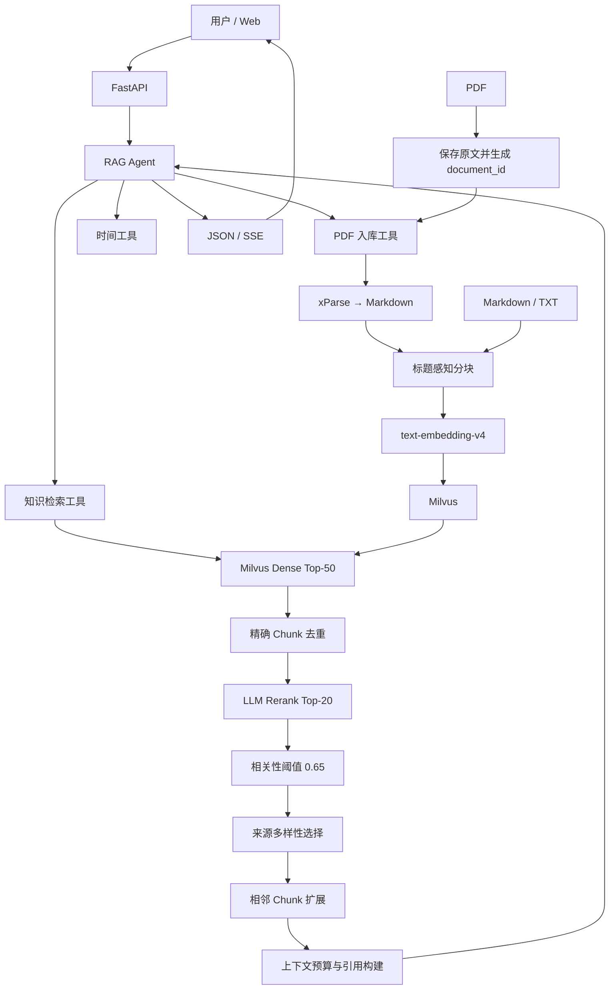

# AVF Research Assistant

> 面向科研文献的智能检索与问答 RAG Agent 平台

AVF Research Assistant 面向动静脉瘘（Arteriovenous Fistula，AVF）科研、教学和算法验证场景。系统支持 PDF、Markdown 和 TXT 文献入库，由 Agent 调用知识检索工具，通过 Milvus 超额召回、LLM Rerank、来源多样性选择和上下文预算控制生成带来源引用的回答。

> 使用边界：系统输出不构成临床诊断或治疗建议，不能替代医生或专业医疗人员的判断。

## 核心能力

- **工具调用 Agent**：基于 LangChain `create_agent`、LangGraph Checkpointer 和通义千问构建单 Agent 工作流，支持知识检索、PDF 入库、入库状态查询和时间查询。
- **多格式文献入库**：MD/TXT 上传后直接分块并索引；PDF 上传后先登记原文，再由 Agent 显式提交 xParse 异步解析与索引任务。
- **两阶段检索**：Dense Top-50 超额召回，经过精确 Chunk 去重、LLM Rerank Top-20、相关性阈值、来源多样性选择和相邻 Chunk 扩展后构建上下文。
- **稳定证据标识**：新入库数据使用 `{document_id}:{sha256(content)[:16]}` 作为逻辑 `chunk_id`，并保存 `source_id`、`chunk_index` 和 `content_hash`。
- **可追溯回答**：上下文包含证据、章节、作者—年份引用和来源文件；检索 Artifact 可供前端、日志和评测复用。
- **流式与会话**：FastAPI 提供普通问答和 SSE 流式问答，`MemorySaver` 按 `session_id` 保存进程内多轮上下文。
- **可重复评测**：保留25题论文级检索消融实验，并新增50题、真实 Milvus Chunk ID 的 Agent 全链路评测与 BL-1 基线评测入口。

## 系统架构



## 处理流程

### 问答链路

```text
用户问题
  → Agent 判断是否调用知识检索工具
  → Milvus Dense Top-50 超额召回
  → chunk_id / content_hash / 正文精确去重
  → LLM Rerank Top-20
  → 0.65 相关性阈值过滤
  → 最终证据选择（默认8个、每个来源最多2个）
  → 对Top-3高分证据尝试相邻Chunk扩展
  → 在12,000字符预算内构建引用上下文
  → Agent 基于证据生成回答
  → JSON或SSE返回
```

### 文献入库链路

MD/TXT：

```text
上传文件 → UTF-8读取 → 标题/字符分块 → Embedding → Milvus
```

PDF：

```text
上传PDF
  → 文件头与大小校验
  → 保存 uploads/originals/{document_id}/
  → 返回 uploaded（此时尚未入库）
  → 用户明确要求后，Agent提交后台任务
  → queued → parsing → parsed → splitting → embedding → indexed
  → 任务状态保存到 uploads/jobs/{job_id}.json
```

PDF 只有在状态为 `indexed` 时才可视为已进入知识库。

## 当前检索配置

| 参数 | 默认值 | 说明 |
|---|---:|---|
| `RAG_CANDIDATE_K` | 50 | Dense 超额召回候选数 |
| `RAG_RERANK_K` | 20 | LLM Rerank 后保留数 |
| `RAG_RERANK_THRESHOLD` | 0.65 | 进入最终选择的最低 Rerank 分数 |
| `RAG_FINAL_CHUNKS` | 8 | 默认最终证据目标数 |
| `RAG_MAX_CHUNKS_PER_SOURCE` | 2 | 每个来源最多选择的 Chunk 数 |
| `RAG_MAX_CONTEXT_CHARS` | 12000 | 最终上下文字符预算 |
| `RAG_MAX_CHARS_PER_EVIDENCE` | 1600 | 预算不足时单条证据的截断上限 |
| `CHUNK_MAX_SIZE` | 1600 | 基础配置；当前二次字符分割器实际使用其2倍 |
| `CHUNK_OVERLAP` | 200 | 字符分割重叠量 |

注意：当前 `DocumentSplitterService` 的递归分割器使用 `chunk_size * 2`，所以配置1600时实际二次分割目标上限约为3200字符；`RAG_MAX_CHARS_PER_EVIDENCE` 也不是对所有完整证据强制截断，只有完整证据无法放入剩余总预算时才应用。

## 评测结果

### 最新50题全链路评测

结果文件：[evaluation/results/20260717_045223/review_eval_summary.json](evaluation/results/20260717_045223/review_eval_summary.json)

| 指标 | 结果 |
|---|---:|
| 题目数 | 50 |
| 执行成功 | 50/50 |
| 工具调用率 | 100% |
| 空答案率 | 0% |
| Doc-Hit | 49/50 = 98.0% |
| Doc-Hit@1 | 82.0% |
| Doc-Hit@3 | 94.0% |
| Doc-Hit@5 | 98.0% |
| Doc-Hit@10 | 98.0% |
| 目标文献平均排名 | 1.3 |
| Strict-Chunk-Hit | 18/50 |

`Strict-Chunk-Hit` 只认可每题唯一指定的严格目标 Chunk。32道未命中严格目标Chunk的问题中，31道仍召回了正确目标论文中的其他证据，因此该指标不能解释为答案正确率36%。

当前 Ragas Faithfulness 和 Answer Relevancy 的汇总均值受到 `NaN` 聚合问题影响，暂不作为对外结论。

### Full与BL-1的50题文档级对比

BL-1完整结果：`evaluation/results/BL1_20260717_052107/`。两组使用相同50题和真实逻辑Chunk标注。

| 指标 | BL-1 Dense Top-5 | Full | 变化 |
|---|---:|---:|---:|
| Doc-Hit | 94% | 98% | +4个百分点 |
| Doc-Hit@1 | 60% | 82% | +22个百分点 |
| Doc-Hit@3 | 88% | 94% | +6个百分点 |
| Doc-Hit@5 | 94% | 98% | +4个百分点 |
| Doc平均排名 | 1.6 | 1.3 | 改善0.3 |
| Strict-Chunk-Hit | 56% | 36% | -20个百分点 |

Full明显改善了目标文献的靠前命中，但唯一严格目标Chunk命中低于BL-1。该现象与Full的Rerank、来源多样性和上下文预算可能选择同一正确论文中的其他证据有关。在增加多可接受Chunk标注并修复回答层Ragas之前，不能宣称Full在所有指标上全面优于BL-1。

### Legacy：25题检索消融实验

以下结果来自2026-07-15的旧版论文级检索实验，用于保留项目演进记录，不代表当前全链路：

| 指标 | 基线 | 旧版去重优化 |
|---|---:|---:|
| 平均来源覆盖数 | 3.00 | 4.76 |
| 重复来源占比 | 40.0% | 4.8% |
| Hit@5 | 76.0% | 88.0% |
| Recall@5 | 42.5% | 62.1% |

## 技术栈

| 层级 | 技术 |
|---|---|
| API | FastAPI、Uvicorn、SSE |
| Agent | LangChain、LangGraph、ChatQwen |
| LLM / Embedding | 通义千问 `qwen-max`、DashScope `text-embedding-v4` |
| 文献解析 | xParse CLI |
| 向量数据库 | Milvus 2.5、MinIO、etcd、Attu |
| 评测 | Ragas、自定义ID命中指标、pytest |
| 部署 | Docker Compose、Windows启动脚本 |

## 项目结构

```text
app/
├── agent/                      # MCP扩展入口
├── api/                        # chat、file、health路由
├── core/                       # LLM与Milvus连接
├── models/                     # 请求、响应、PDF任务模型
├── services/
│   ├── retrieval/              # recall、rerank、diversity、context builder
│   ├── pdf_ingestion_service.py
│   ├── xparse_parser_service.py
│   ├── document_splitter_service.py
│   ├── vector_index_service.py
│   └── rag_agent_service.py
└── tools/                      # 知识检索、PDF入库、时间工具

evaluation/                     # Legacy、50题Full、BL-1与Ragas评测
docs/                           # 架构、设计、问题与评测文档
scripts/                        # PDF批量辅助脚本
static/                         # 原生Web界面
uploads/                        # 本地原文、解析结果和任务状态（不提交Git）
volumes/                        # Milvus持久化数据（不提交Git）
```

## 快速开始

### 1. 环境要求

- Python 3.11～3.13
- Docker Desktop
- DashScope API Key
- xParse CLI（仅PDF解析需要）

### 2. 安装

```powershell
Copy-Item .env.example .env
python -m pip install -e .
```

在 `.env` 中设置：

```dotenv
DASHSCOPE_API_KEY=your-real-api-key
```

### 3. 启动

```powershell
.\start-windows.bat
```

或手动启动：

```powershell
docker compose -f vector-database.yml up -d etcd minio standalone
python run_server.py
```

| 地址 | 用途 |
|---|---|
| <http://localhost:9900> | Web界面 |
| <http://localhost:9900/docs> | Swagger |
| <http://localhost:9900/health> | 健康检查 |
| <http://localhost:8000> | Attu（单独启动后） |

## API

| 方法 | 路径 | 功能 |
|---|---|---|
| `GET` | `/health` | 服务与Milvus健康检查 |
| `POST` | `/api/chat` | 非流式Agent问答 |
| `POST` | `/api/chat_stream` | SSE流式Agent问答 |
| `POST` | `/api/chat/clear` | 清空会话 |
| `GET` | `/api/chat/session/{session_id}` | 查询会话历史 |
| `POST` | `/api/upload` | 上传PDF/MD/TXT；PDF仅登记，MD/TXT直接索引 |
| `POST` | `/api/index_directory` | 索引目录中的MD/TXT文件 |

PDF解析和入库由 Agent 工具触发，不存在独立的公开PDF入库HTTP路由。

## 运行评测

详细说明见 [evaluation/README.md](evaluation/README.md)。正式50题全链路使用：

```powershell
python evaluation/evaluate_review.py
```

完整 BL-1 使用：

```powershell
python evaluation/evaluate_bl1.py
```

两套评测都会调用 Milvus、生成模型和 Ragas 评判模型，不应并行运行。运行前应确认外部调用成本；建议先使用 `--limit 3` 冒烟验证。当前Full和BL-1各已有一次50题结果，重复运行会产生新的模型调用费用。

## 数据与安全

- 不提交 `.env`、`uploads/`、`volumes/`。
- 仓库不包含受版权保护的论文原文和本地Milvus数据。
- 不将评测集自动生成的证据摘要冒充人工医学结论。
- 不将系统输出用于临床决策。

## 已知限制

- 0.65阈值在低分查询上可能过滤全部结果；最新评测中 `rq007` 出现该情况。
- 旧索引不一定具有真实 `chunk_index`，相邻Chunk扩展需要重建索引后才完全可靠。
- 当前分块配置1600实际对应约3200字符的二次分割上限。
- Ragas均值NaN过滤和完整Trace持久化仍需修复。
- Query Rewrite、Multi-query、混合检索和 `source_filter` 尚未启用或实现。

## License

仓库当前未提供独立 `LICENSE` 文件。在明确开源许可证之前，默认保留所有权利。
