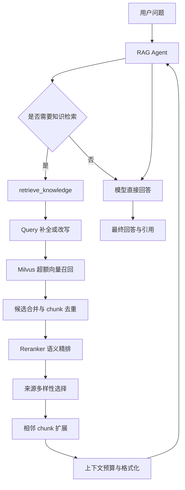

# RAG 超额召回与 Rerank 技术设计

## 1. 文档信息

| 项目 | 内容 |
|---|---|
| 文档名称 | RAG 超额召回与 Rerank 技术设计 |
| 适用项目 | AVF Research Assistant |
| 文档状态 | 设计已部分落地；本文同时保留后续规划 |
| 目标读者 | 后端开发、算法开发、测试与项目维护人员 |

### 当前实现快照（2026-07-17）

| 能力 | 状态 | 当前实现 |
|---|---|---|
| Dense超额召回 | 已实现 | auto模式Top-50 |
| 候选精确去重 | 已实现 | chunk_id → content_hash → 完整正文 |
| LLM Rerank | 已实现 | Top-20，分批Listwise评分 |
| 相关性阈值 | 已实现但有风险 | 固定0.65，无零结果保底 |
| 来源多样性 | 已实现 | 默认最终8个、每来源最多2个 |
| 相邻Chunk扩展 | 部分可靠 | 新索引有效，旧索引缺少真实chunk_index |
| 上下文预算 | 已实现 | 总预算12000字符 |
| 稳定逻辑Chunk ID | 新索引已实现 | {document_id}:{sha256(content)[:16]} |
| Query Rewrite | 未接入主链路 | 配置默认关闭 |
| Multi-query | 未接入主链路 | 配置默认关闭 |
| Hybrid Search | 未实现 | 仍为Dense向量召回 |
| source_filter | 未实现 | 参数已预留 |

候选精确去重与来源多样性选择必须保持为两个阶段：前者只删除同一逻辑Chunk，后者才限制同一论文进入最终上下文的数量。

当前分块配置虽然为1600，但递归分割器实际使用 `chunk_size * 2`，二次分割目标上限约3200字符。旧索引数据尚未统一重建，因此本文涉及1600字符硬上限或可靠邻接关系的描述应视为目标设计，而非对全部历史数据的现状保证。

## 2. 背景

当前系统采用基于 LangChain、LangGraph、DashScope Embedding、Qwen 和 Milvus 的 RAG 问答架构。

现有知识检索流程为：

1. Agent 判断是否调用 `retrieve_knowledge`。
2. 检索工具调用 Milvus 向量检索。
3. 按 `rag_top_k * 3` 召回候选 chunk。
4. 按文件名去重，同一篇论文只保留最相关的一个 chunk。
5. 将最终结果格式化后交给模型生成回答。

当前方案结构简单，但存在以下问题：

- 候选召回数量偏少，复杂问题容易漏召回。
- 在精排前按文件名去重，可能提前丢失同一论文中的重要 chunk。
- 只使用向量相似度排序，没有独立的语义相关性精排。
- 每篇论文固定保留一个 chunk，无法覆盖方法、实验和结果等多个章节。
- 缺少相邻 chunk 扩展，命中的内容可能缺少上下文。
- 缺少最低相关性阈值和检索置信度。
- 检索内部过程缺少结构化输出，不利于评测和前端引用展示。

## 3. 建设目标

本次设计目标是建立一个由检索工具内部统一编排的两阶段检索系统：

```text
超额召回 Recall
    ↓
候选合并与去重
    ↓
Rerank 精排
    ↓
来源多样性选择
    ↓
相邻上下文扩展
    ↓
上下文预算控制
    ↓
模型生成回答
```

具体目标：

- 提高相关文献和关键 chunk 的召回率。
- 使用 Reranker 提升候选排序质量。
- 支持同一论文返回多个互补 chunk。
- 避免最终上下文被单篇论文占满。
- 为模型提供结构清晰、可引用、可追踪的证据。
- 保持 Agent 工具接口简单、稳定。
- 支持后续扩展多查询召回、关键词检索和混合检索。

## 4. 设计原则

### 4.1 Agent 负责决策，工具负责检索

Agent 只负责：

- 判断是否需要查询知识库。
- 生成或传递检索问题。
- 根据工具返回的证据生成回答。
- 在证据不足时决定是否补充检索。

检索工具负责：

- Query 处理。
- 超额召回。
- 候选去重。
- Rerank。
- 来源多样性控制。
- 相邻 chunk 扩展。
- 上下文组装。

不建议让 Agent 逐个读取候选 chunk 并自行比较。该方式会增加模型调用次数、延迟和不确定性。

### 4.2 先 Rerank，后进行来源限制

不得在 Rerank 前执行“一篇论文只保留一个 chunk”的强去重。

同一论文中的方法、数据集、实验结果和结论可能分布在不同 chunk 中。正确顺序应为：

```text
超额召回多个 chunk
    ↓
chunk 级 Rerank
    ↓
根据问题类型限制每篇论文的 chunk 数量
```

### 4.3 召回阶段追求不遗漏，精排阶段追求准确

- Milvus 召回阶段应适当扩大候选数量。
- Rerank 阶段负责筛除语义上不相关或仅表面相似的候选。
- 最终选择阶段负责证据覆盖度和来源多样性。

## 5. 总体架构



## 6. Agent 工具设计

### 6.1 主检索工具

工具名称：

```text
retrieve_knowledge
```

建议接口：

```python
def retrieve_knowledge(
    query: str,
    top_k: int | None = None,
    search_mode: str = "auto",
    source_filter: list[str] | None = None,
) -> tuple[str, RetrievalArtifact]:
    ...
```

参数说明：

| 参数 | 类型 | 说明 |
|---|---|---|
| `query` | `str` | 用户问题或经过 Agent 整理的检索问题 |
| `top_k` | `int \| None` | 最终目标 chunk 数量；为空时使用系统配置 |
| `search_mode` | `str` | 检索模式：`auto`、`focused`、`comparison`、`broad` |
| `source_filter` | `list[str] \| None` | 可选的论文或文件范围过滤 |

检索模式：

| 模式 | 适用问题 | 推荐策略 |
|---|---|---|
| `auto` | 一般问题 | 自动使用默认参数 |
| `focused` | 单一概念或单篇论文 | 单 query，允许同一来源返回更多 chunk |
| `comparison` | 多论文、多模型比较 | 多来源优先，每篇论文限制 chunk 数量 |
| `broad` | 综述、研究进展 | 扩大候选数量，提高来源覆盖度 |

### 6.2 补充检索工具

可选工具名称：

```text
retrieve_more
```

建议接口：

```python
def retrieve_more(
    query: str,
    excluded_chunk_ids: list[str] | None = None,
    excluded_sources: list[str] | None = None,
    focus: str | None = None,
) -> tuple[str, RetrievalArtifact]:
    ...
```

使用场景：

- 首次检索缺少关键性能指标。
- 需要补充其他论文或不同研究方法。
- 需要查找反例、限制条件或不同结论。
- 首次检索置信度较低。

第一阶段可以只实现 `retrieve_knowledge`，将补充检索作为后续增强能力。

### 6.3 文档上下文工具

可选工具名称：

```text
get_document_context
```

建议接口：

```python
def get_document_context(
    source_id: str,
    chunk_index: int,
    window: int = 1,
) -> list[Document]:
    ...
```

该能力更适合由 `retrieve_knowledge` 内部自动调用，不建议默认暴露给 Agent。

## 7. 检索处理流程

### 7.1 Query 补全

对于独立问题，可以直接使用原始 query。

对于包含代词或依赖会话上下文的问题，需要生成可独立检索的 query。

示例：

```text
上一轮：
哪些论文使用血流声音检测 AVF 狭窄？

当前问题：
它们的准确率分别是多少？

补全后的检索问题：
使用血流声音检测 AVF 狭窄的论文分别取得了什么准确率？
```

第一阶段可以直接使用原始 query。后续再加入基于会话历史的 Query Rewriter。

### 7.2 超额召回

建议默认参数：

```python
final_chunk_count = 8
candidate_count = 50
rerank_count = 20
max_chunks_per_source = 2
max_sources = 5
```

也可以使用动态比例：

```python
candidate_count = max(final_chunk_count * 8, 40)
rerank_count = max(final_chunk_count * 3, 15)
```

不同模式的建议参数：

| 模式 | 候选召回 | Rerank 后保留 | 最终 chunk | 每来源上限 |
|---|---:|---:|---:|---:|
| `focused` | 30 | 12 | 6 | 4 |
| `comparison` | 60 | 24 | 10 | 2 |
| `broad` | 80 | 30 | 12 | 2 |
| `auto` | 50 | 20 | 8 | 2 |

### 7.3 候选去重

候选阶段只删除真正重复的 chunk，不按论文来源强制去重。

推荐去重依据：

1. `chunk_id` 完全相同。
2. `content_hash` 完全相同。
3. 同一来源中正文高度重复。

不应在该阶段执行：

```python
if source_already_exists:
    skip_chunk()
```

### 7.4 Rerank

Rerank 输入应包含：

- 用户 query。
- 论文名称。
- Markdown 标题路径。
- chunk 正文。

示例：

```text
Query:
不同深度学习模型在 AVF 狭窄检测中的性能如何？

Document:
来源：Zhou et al. 2023
章节：Experiments > Classification Results
内容：The proposed model achieved ...
```

Rerank 输出结构：

```python
{
    "chunk_id": "uuid",
    "source_id": "source-uuid",
    "source": "paper.md",
    "chunk_index": 12,
    "vector_score": 0.81,
    "rerank_score": 0.93,
    "content": "...",
    "metadata": {...},
}
```

推荐流程：

```text
Milvus Top 50
    ↓
批量 Rerank
    ↓
按 rerank_score 降序排列
    ↓
保留 Top 20
```

第一阶段建议直接使用 `rerank_score` 排序，暂不混合多个分数。

如果后续需要融合分数，可采用：

```text
final_score =
    0.75 × rerank_score
  + 0.15 × normalized_vector_score
  + 0.10 × metadata_score
```

当前 Milvus 使用 L2 距离，距离越小越相关。如果需要转换为正向分数，可以使用：

```python
vector_score = 1 / (1 + l2_distance)
```

### 7.5 来源多样性选择

Rerank 完成后，按照问题类型执行来源限制。

基本选择算法：

```python
selected = []
source_counts = {}

for candidate in reranked_candidates:
    source = candidate.source_id

    if source_counts.get(source, 0) >= max_chunks_per_source:
        continue

    selected.append(candidate)
    source_counts[source] = source_counts.get(source, 0) + 1

    if len(selected) >= final_chunk_count:
        break
```

来源限制建议：

| 问题类型 | 每篇论文最大 chunk 数 |
|---|---:|
| 单篇论文分析 | 4～6 |
| 多模型比较 | 2 |
| 文献综述 | 1～2 |
| 性能指标查询 | 2 |

### 7.6 相邻 chunk 扩展

当高分 chunk 内容不完整时，可以补充相邻上下文：

```text
命中 chunk_index = 12
    ↓
读取 chunk_index = 11、12、13
```

建议只扩展：

- Rerank 前 3 名。
- 明显存在句义截断的 chunk。
- 包含实验指标但缺少实验条件的 chunk。
- 包含结论但缺少方法说明的 chunk。

相邻扩展结果应进行重复检查，避免同一个 chunk 多次进入上下文。

### 7.7 上下文预算控制

建议新增配置：

```python
rag_max_context_tokens = 6000
rag_max_context_chars = 12000
```

上下文组装顺序：

1. 按 Rerank 分数排序。
2. 优先保留不同论文的高分证据。
3. 合并相邻且连续的 chunk。
4. 删除高度重复文本。
5. 超出预算时，从最低分证据开始移除。

## 8. 上下文格式

建议工具返回给模型的文本格式：

```text
[证据 1]
引用：(Zhou et al. 2023)
来源：Zhou 等 - 2023 - Deep learning analysis...
章节：Experiments > Results
内容：
……

[证据 2]
引用：(Song et al. 2023)
来源：Song 等 - 2023 - An effective AI model...
章节：Model Architecture
内容：
……

---
参考文献：
(Zhou et al. 2023): Zhou 等 - 2023 - ...
(Song et al. 2023): Song 等 - 2023 - ...
```

不建议在模型上下文中展示过多内部技术字段，例如 UUID、原始距离和调试信息。

## 9. Artifact 数据结构

工具继续使用 LangChain 的 `content_and_artifact` 返回模式：

```python
return formatted_context, artifact
```

建议 Artifact：

```python
from dataclasses import dataclass, field
from typing import Any


@dataclass
class RetrievalItem:
    chunk_id: str
    source_id: str
    source: str
    chunk_index: int
    content: str
    vector_score: float | None = None
    rerank_score: float | None = None
    metadata: dict[str, Any] = field(default_factory=dict)


@dataclass
class RetrievalArtifact:
    original_query: str
    rewritten_query: str
    query_variants: list[str]
    search_mode: str
    candidate_count: int
    reranked_count: int
    selected_count: int
    confidence: str
    documents: list[RetrievalItem]
```

Artifact 的用途：

- 检索效果评测。
- 问题排查和日志记录。
- 前端展示引用卡片。
- 保存真实 Agent 检索轨迹。
- 分析召回和 Rerank 各阶段效果。

## 10. 文档入库元数据调整

为支持相邻 chunk 查询和稳定去重，建议每个 chunk 增加以下 metadata：

```python
{
    "_source": "uploads/paper.md",
    "_file_name": "paper.md",
    "_extension": ".md",
    "source_id": "stable-source-id",
    "chunk_id": "stable-or-random-id",
    "chunk_index": 12,
    "chunk_count": 36,
    "content_hash": "sha256...",
    "h1": "Experiments",
    "h2": "Results",
}
```

字段说明：

| 字段 | 说明 |
|---|---|
| `source_id` | 文档稳定标识 |
| `chunk_id` | chunk 唯一标识 |
| `chunk_index` | chunk 在文档内的顺序 |
| `chunk_count` | 文档 chunk 总数 |
| `content_hash` | 内容去重和更新判断 |
| `h1`、`h2` | Markdown 章节路径 |

## 11. 推荐模块划分

建议将检索能力拆分为以下服务：

```text
app/services/retrieval/
├── retrieval_service.py
├── query_rewrite_service.py
├── recall_service.py
├── rerank_service.py
├── diversity_service.py
├── context_expansion_service.py
├── context_builder.py
└── retrieval_models.py
```

职责：

| 模块 | 职责 |
|---|---|
| `retrieval_service.py` | 编排完整检索流程 |
| `query_rewrite_service.py` | Query 补全和多查询生成 |
| `recall_service.py` | Milvus 超额召回 |
| `rerank_service.py` | 批量精排 |
| `diversity_service.py` | 来源多样性和数量控制 |
| `context_expansion_service.py` | 相邻 chunk 扩展 |
| `context_builder.py` | Token 预算和上下文格式化 |
| `retrieval_models.py` | 请求、候选、结果数据模型 |

Agent 可见工具保持精简：

```text
DEFAULT_LOCAL_AGENT_TOOLS
├── retrieve_knowledge
├── retrieve_more
└── get_current_time
```

## 12. 配置设计

建议在配置中增加：

```python
# 最终结果
rag_final_chunks: int = 8
rag_max_sources: int = 5
rag_max_chunks_per_source: int = 2

# 超额召回
rag_candidate_k: int = 50
rag_rerank_k: int = 20

# Rerank
rag_rerank_enabled: bool = True
rag_rerank_model: str = ""
rag_rerank_threshold: float = 0.0

# 上下文扩展
rag_neighbor_expansion_enabled: bool = True
rag_neighbor_window: int = 1

# 上下文预算
rag_max_context_tokens: int = 6000
rag_max_context_chars: int = 12000

# Query 处理
rag_query_rewrite_enabled: bool = False
rag_multi_query_enabled: bool = False
rag_multi_query_count: int = 3
```

建议保留环境变量覆盖能力。

## 13. 检索置信度

工具应根据 Rerank 结果返回置信度：

```text
high：
- 存在多个高相关证据
- 证据来自两个或以上来源
- 证据能够直接覆盖问题

medium：
- 存在一至两个较高相关证据
- 证据覆盖问题的一部分

low：
- 最高相关性仍低于阈值
- 检索结果与问题只有弱相关性
- 缺少回答所需的关键指标或结论
```

当置信度为 `low` 时，Agent 应：

- 明确说明知识库证据不足。
- 不编造论文、指标或引用。
- 必要时调用 `retrieve_more`。
- 补充检索后仍不足时停止推断。

## 14. 异常和降级策略

| 异常情况 | 降级策略 |
|---|---|
| Reranker 请求失败 | 使用原始向量排序继续处理 |
| Query 改写失败 | 使用原始用户 query |
| 相邻 chunk 查询失败 | 仅返回原始命中 chunk |
| Milvus 无结果 | 返回“未找到相关资料” |
| 候选不足 | 返回现有证据并降低置信度 |
| 上下文超限 | 删除最低分 chunk |
| 部分 metadata 缺失 | 使用文件名和正文继续处理 |

Rerank 失败不应导致整个问答接口不可用。

## 15. 日志与可观测性

每次检索建议记录：

```text
session_id
original_query
rewritten_query
search_mode
candidate_count
rerank_input_count
rerank_output_count
selected_count
selected_sources
best_rerank_score
confidence
recall_duration_ms
rerank_duration_ms
total_duration_ms
```

日志中不应记录 API Key 等敏感信息。

## 16. 评测方案

### 16.1 检索指标

- Hit@K
- Recall@K
- MRR
- nDCG@K
- 来源覆盖率
- 目标论文召回率
- 目标 chunk 排名

需要分别评测：

```text
Milvus 原始召回结果
Rerank 后结果
来源多样性处理后结果
最终提供给模型的结果
```

### 16.2 生成指标

- 引用正确率。
- 引用来源是否真实存在于检索结果。
- 指标和结论是否得到证据支持。
- 回答完整性。
- 无证据内容比例。
- 低置信度时是否正确拒答。

### 16.3 性能指标

- 向量召回耗时。
- Rerank 耗时。
- 完整检索耗时。
- 首 Token 延迟。
- 单次检索外部 API 成本。

## 17. 测试设计

### 17.1 单元测试

- 候选 chunk 去重。
- L2 距离向正向分数转换。
- Rerank 排序。
- 每来源 chunk 数量限制。
- 相邻 chunk 扩展。
- 上下文 Token 预算裁剪。
- 低置信度判断。
- Reranker 异常降级。

### 17.2 集成测试

- 上传文档后 metadata 是否完整。
- 问题能否召回正确论文。
- Rerank 是否将目标 chunk 提升到前列。
- 同一论文是否允许返回多个互补 chunk。
- 比较型问题是否覆盖多个来源。
- Agent 是否正确使用工具返回的引用。

### 17.3 回归测试

使用固定问题集，对比改造前后的：

- Recall@5、Recall@10。
- MRR 和 nDCG。
- 回答引用正确率。
- 平均检索耗时。
- API 调用成本。

## 18. 分阶段实施方案

### 第一阶段：单查询超额召回与 Rerank

范围：

- Milvus 召回从 15 个提升到约 50 个。
- 新增 Rerank 服务。
- Rerank 后进行来源多样性选择。
- 每篇论文最多返回 2 个 chunk。
- 最终返回约 8 个 chunk。
- Rerank 失败时降级到向量排序。

目标流程：

```text
原始 query
→ Milvus Top 50
→ Rerank Top 20
→ 来源多样性选择
→ 最终 Top 8
→ 模型回答
```

### 第二阶段：上下文扩展与结构化 Artifact

范围：

- 入库增加 `source_id`、`chunk_index` 和 `content_hash`。
- 增加相邻 chunk 扩展。
- 增加上下文预算控制。
- 返回结构化 Artifact。
- 支持前端展示参考论文和证据。

### 第三阶段：Query 改写与多路召回

范围：

- 会话 Query 补全。
- 比较型问题多查询拆分。
- 向量检索与关键词检索融合。
- 增加 `retrieve_more`。
- 使用 RRF 或其他融合算法合并多路候选。

## 19. 验收标准

第一阶段建议验收标准：

- 检索工具能够完成超额召回和 Rerank。
- Rerank 前不再按文件名强制只保留一个 chunk。
- 比较型问题最终结果至少覆盖两个来源。
- 同一来源默认最多返回两个 chunk。
- Rerank 服务失败时能够自动降级。
- 最终上下文不超过配置预算。
- 检索结果包含可追踪的来源、chunk 标识和评分。
- 固定评测集的 Recall@K、MRR 或 nDCG 不低于改造前。
- 引用正确率不低于改造前。

## 20. 风险与注意事项

### 20.1 延迟增加

超额召回和 Rerank 会增加响应时间。需要采用：

- 批量 Rerank。
- 限制候选数量。
- 为 focused 问题使用较小候选集。
- 必要时增加缓存。

### 20.2 成本增加

如果使用大模型进行 Rerank，候选越多成本越高。优先使用专用 Reranker，LLM 只用于少量候选的高级判断。

### 20.3 阈值不稳定

不同 Rerank 模型的分数区间不同，不能直接设置通用阈值。需要通过固定评测集校准。

### 20.4 分块质量影响上限

Rerank 无法完全弥补不合理分块。需要确保：

- chunk 不在表格、句子或实验结果中间随意截断。
- Markdown 标题 metadata 正确。
- 相邻 chunk 能够通过 `chunk_index` 找回。

### 20.5 来源多样性与相关性的冲突

过度强调来源多样性可能排除同一篇关键论文中的重要证据。来源限制应根据问题类型动态调整。

## 21. 最终推荐方案

推荐优先落地以下结构：

```text
Agent
  ↓
retrieve_knowledge
  ↓
原始 Query
  ↓
Milvus 超额召回 Top 50
  ↓
chunk 级 Rerank Top 20
  ↓
每篇论文最多 2 个 chunk
  ↓
最终选择 8 个 chunk
  ↓
必要时扩展相邻 chunk
  ↓
按 Token 预算格式化证据
  ↓
Qwen 生成带引用回答
```

该方案能够在不显著增加 Agent 复杂度的前提下，提高知识检索的召回率、排序准确度、证据完整性和引用可靠性。
