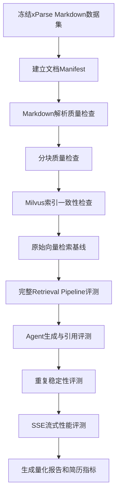

# 基于 xParse Markdown 的 RAG 评测指南

> **Archive / Legacy**：69篇语料与旧评测路径方案。当前正式评测以`evaluation/README.md`为准。

> **语料状态（2026-07-22）**：本文中的“69篇/69个”是历史方案记录。删除47篇未入库PDF及1篇空Markdown后得到68篇有效语料，再删除2篇书目重复来源，当前为66篇、1284个Chunk；Milvus已清空重建，但Full/BL-1尚未重跑。

## 1. 文档信息

| 项目 | 内容 |
|---|---|
| 文档名称 | 基于 xParse Markdown 的 RAG 评测指南 |
| 适用项目 | AVF Research Assistant |
| 数据来源 | TextIn xParse 解析生成的 Markdown |
| Markdown目录 | `uploads/parsed/doc_xxxxxx/*.md` |
| 评测对象 | 分块、Milvus检索、Rerank、Agent工具调用、回答引用、SSE流式输出 |
| 更新时间 | 2026-07-17 |

> **当前正式入口**：本文保留xParse Markdown数据质量和分块评测方法；50题Agent全链路评测不再以Markdown文件名作为金标准，而使用 `evaluation/ragas_50_actual_chunk_review.csv` 中的真实Milvus逻辑Chunk ID。运行说明以 `evaluation/README.md` 为准。

当前逻辑Chunk ID：

```text
{document_id}:{sha256(chunk_content)[:16]}
```

需要区分：

- 文档级命中：目标论文是否进入检索结果；
- Strict-Chunk-Hit：唯一指定目标Chunk是否命中；
- 可接受Chunk命中：命中任一人工审核的可独立支持答案Chunk；
- 回答层指标：Faithfulness、Answer Relevancy以及未来人工参考答案审核后的正确性。

旧的 `evaluation/questions.csv` 已不再是当前正式输入。Legacy 25题脚本使用 `evaluation/questions_25.csv`；Full和BL-1使用 `evaluation/ragas_50_actual_chunk_review.csv`。

## 2. 当前数据快照

当前检查到：

```text
xParse Markdown文件：69个
Markdown目录：uploads/parsed/
目录结构：uploads/parsed/{document_id}/{paper_name}.md
```

任务记录中存在：

```text
indexed任务记录：107
failed任务记录：588
```

任务记录数量不能直接当作论文数量，原因包括：

- 同一个 `document_id` 可能多次提交任务。
- 同一篇PDF可能发生重新解析或重新索引。
- 失败任务可能是额度、网络、解析或重试产生的历史记录。
- 一个PDF可能同时存在旧任务和新任务。

评测必须以“去重后的有效文档”为单位，而不是以任务JSON数量为单位。

## 3. 评测目标

本次评测需要回答以下问题：

1. xParse生成的Markdown质量是否适合RAG。
2. Markdown经过分块后是否保持科研语义完整。
3. Milvus是否能够召回正确论文和chunk。
4. Rerank是否提升相关结果排名。
5. 无关检测论文是否会进入病因、机制等问题的上下文。
6. Agent是否稳定调用正确工具。
7. 回答中的引用是否真实且支持对应结论。
8. 流式输出是否稳定，是否泄漏内部Rerank评分。
9. 同一个问题多次运行时，来源和核心结论是否稳定。

## 4. 评测总流程



## 5. 第一步：冻结评测数据集

正式评测前必须冻结以下内容：

```text
Markdown文件集合
问题集
Milvus collection
Embedding模型
Rerank模型
Agent模型
分块配置
检索配置
```

建议为本次评测创建版本标识：

```text
dataset_version = xparse_md_20260717_v1
collection_name = biz
embedding_model = text-embedding-v4
embedding_dimension = 1024
```

评测期间不得：

- 继续向 `biz` 写入新论文。
- 修改分块参数后不重新索引。
- 修改问题标准答案。
- 在部分实验中更换Embedding或Rerank模型。
- 用测试集结果反复调整阈值。

## 6. 第二步：建立评测Manifest

建议生成：

```text
evaluation/parsed_eval_manifest.csv
```

字段：

```csv
document_id,markdown_path,markdown_filename,original_pdf,job_id,status,chunk_count,char_count,sha256,is_duplicate,include_in_eval,exclude_reason
```

示例：

```csv
doc_16308d,uploads/parsed/doc_16308d/Song_2023.md,Song_2023.md,Song_2023.pdf,job_xxx,indexed,18,45231,abc...,false,true,
```

### 6.1 Manifest生成规则

按以下条件选择有效文档：

```text
Markdown文件存在
Markdown不为空
能够以UTF-8读取
关联原始PDF存在
至少有一个最新任务状态为indexed
Milvus中存在对应_document_id或_source
```

### 6.2 去重规则

优先按照以下字段去重：

```text
document_id
→ 原始PDF SHA-256
→ Markdown完整内容SHA-256
→ 规范化论文标题
```

同一论文多次任务只保留：

```text
最新且成功的indexed版本
```

不能直接使用：

```text
indexed任务数 = 论文数
```

## 7. 第三步：Markdown解析质量评测

在进入RAG评测前，先验证xParse输出本身。

## 7.1 基础质量指标

| 指标 | 计算方式 |
|---|---|
| 有效Markdown率 | 有效Markdown数 / 去重后目标PDF数 |
| 空文件率 | 空Markdown数 / Markdown总数 |
| UTF-8读取成功率 | 可正常读取文件数 / Markdown总数 |
| 平均字符数 | 所有有效Markdown字符数平均值 |
| 字符数P50/P95 | Markdown长度分布 |
| 疑似重复率 | 内容哈希重复文档数 / 有效Markdown数 |

## 7.2 结构保留指标

建议抽样检查至少10～15篇论文：

- 标题是否保留。
- Abstract是否完整。
- Methods、Results、Discussion是否可识别。
- 表格标题和正文是否对应。
- 公式是否出现严重乱码。
- 图片占位符是否产生大量噪声。
- 参考文献是否与正文混杂。
- 页眉、页脚和页码是否被重复提取。

建议记录：

```text
Heading Preservation Rate
Table Readability Rate
Reference Noise Rate
Header/Footer Noise Rate
OCR Garbled Rate
```

## 7.3 人工抽样表

建议生成：

```text
evaluation/parsed_markdown_review.csv
```

字段：

```csv
document_id,file_name,title_ok,abstract_ok,headings_ok,tables_ok,formula_ok,reference_noise,garbled_text,reviewer_notes
```

## 8. 第四步：分块质量评测

## 8.1 分块配置必须记录真实生效值

不要只记录：

```text
CHUNK_MAX_SIZE=1600
```

必须记录分块器实际使用的值。

当前代码仍存在：

```python
chunk_size=self.chunk_size * 2
```

如果配置为1600，实际目标可能是3200字符。因此评测报告必须以实际chunk长度统计为准。

## 8.2 分块统计指标

需要生成：

```text
总chunk数
每篇平均chunk数
chunk长度最小值
chunk长度平均值
chunk长度P50
chunk长度P95
chunk最大值
短chunk比例
超长chunk比例
```

建议定义：

```text
短chunk：小于300字符
目标chunk：300～1800字符
超长chunk：大于2000字符
```

### 推荐目标

```text
chunk长度P50：1200～1800字符
chunk长度P95：不超过2000字符
小于300字符比例：低于5%
大于2000字符比例：接近0%
```

## 8.3 语义完整性抽样

抽样检查：

- 一个句子是否被从中间切断。
- 表格是否被拆成无意义片段。
- Methods和Results是否被错误合并。
- Markdown标题是否保存在metadata。
- 同一chunk是否包含多个无关章节。
- overlap是否产生大量重复正文。

## 9. 第五步：Milvus索引一致性检查

每个Manifest文档需要验证：

```text
Markdown存在
→ 分块成功
→ Milvus存在对应source
→ chunk数量大于0
→ metadata可追踪到原PDF和Markdown
```

## 9.1 Metadata完整率

建议检查字段：

```text
_document_id
_source
_parsed_source
_file_name
_parser
_parser_mode
source_id
chunk_id
chunk_index
chunk_count
content_hash
h1
h2
```

计算：

```text
Metadata Completeness
= 必填字段完整的chunk数 / 总chunk数
```

### 推荐目标

```text
核心metadata完整率 = 100%
chunk_index有效率 = 100%
content_hash有效率 = 100%
```

如果 `chunk_index` 使用检索排名代替原文顺序，相邻chunk扩展指标不得进入正式报告。

## 9.2 索引覆盖率

```text
Index Coverage
= Milvus中成功入库的有效文档数 / Manifest有效文档数
```

建议目标：

```text
100%
```

## 9.3 重复索引率

同一 `document_id`、`source_id` 或内容哈希出现多个活动版本时，应计为重复索引。

```text
Duplicate Index Rate
= 重复活动版本chunk数 / 总chunk数
```

建议目标：

```text
0%
```

## 10. 第六步：构建问题集

## 10.1 问题集选择

如果50道问题对应的相关PDF都已经：

```text
xParse成功
Markdown存在
Milvus入库成功
```

则使用：

```text
evaluation/questions_v2.csv
```

否则应基于Manifest过滤，生成：

```text
evaluation/questions_parsed.csv
```

只有当一道题的标准答案论文全部或按预定规则部分存在于评测知识库时，才能进入正式Recall分母。

## 10.2 问题集字段

建议扩展为：

```csv
question_id,question,relevant_files,category,notes,expected_tool,must_include,must_not_include,expected_behavior,is_critical
```

## 10.3 必须包含的关键问题

```text
请问动静脉瘘狭窄的原因是什么？
这些原因的影响排序是怎么样的？
```

该问题需要标注：

```text
expected_tool = retrieve_knowledge
must_not_include = STFT检测;ResNet检测;ANN诊断
expected_behavior = 无直接比较证据时不得强行排序
is_critical = true
```

## 10.4 开发集与测试集

建议：

```text
开发集：20题
测试集：30题
```

开发集用于：

- 调整Rerank阈值。
- 调整candidate_k。
- 调整final_chunks。
- 调整每来源chunk上限。

测试集只用于最终报告，不用于反复调参。

## 11. 第七步：建立对照实验

必须同时运行以下方案：

```text
A：原始向量Top-K
B：超额召回 + chunk精确去重
C：超额召回 + 去重 + Rerank
D：完整链路
   超额召回
   + 精确去重
   + Rerank
   + 相关性阈值
   + 来源多样性
   + 上下文预算
```

对比表：

| 方案 | Hit@5 | Recall@5 | nDCG@10 | 无关证据率 | 来源覆盖 | 重复率 | P95耗时 |
|---|---:|---:|---:|---:|---:|---:|---:|
| A 原始向量 |  |  |  |  |  |  |  |
| B 超额召回 |  |  |  |  |  |  |  |
| C 加Rerank |  |  |  |  |  |  |  |
| D 完整链路 |  |  |  |  |  |  |  |

## 12. 第八步：检索指标

## 12.1 核心指标

### Hit@5

```text
Top-5中至少包含一篇相关论文的问题比例
```

### Recall@5

```text
Top-5命中的不同相关论文数 / 标注相关论文总数
```

### nDCG@10

用于判断Rerank是否将相关结果排在前面。

### MRR

```text
每题第一个相关结果排名倒数的平均值
```

## 12.2 上下文质量指标

### 无关证据进入率

```text
最终上下文中的无关chunk数 / 最终chunk总数
```

### 来源覆盖数

```text
最终Top-K中不同论文来源数
```

### 重复来源占比

```text
1 - 不同来源数 / 实际结果数
```

### 阈值清空率

```text
阈值过滤后没有任何证据的问题数 / 总问题数
```

### Rerank降级率

```text
降级到向量排序的请求数 / 应执行Rerank的请求数
```

## 12.3 推荐目标

| 指标 | 建议目标 |
|---|---:|
| Hit@5 | 不低于旧基线88% |
| Recall@5 | 不低于旧基线62.1% |
| nDCG@10 | 建议达到0.70以上 |
| 无关证据进入率 | 不超过5% |
| 关键病因问题无关证据率 | 0% |
| 阈值清空率 | 不超过2% |
| 降级后有证据率 | 100% |

## 13. 第九步：Agent功能稳定性评测

每个问题重复执行：

```text
普通问题：3次
关键问题：5次
```

## 13.1 工具选择准确率

```text
正确工具决策次数 / 总测试次数
```

建议目标：

```text
≥95%
```

## 13.2 工具调用一致率

```text
使用众数工具轨迹的次数 / 重复次数
```

建议目标：

```text
≥90%
```

## 13.3 来源集合稳定性

使用Jaccard：

```text
Source Jaccard
= 两次来源集合交集 / 两次来源集合并集
```

建议目标：

```text
平均Jaccard ≥0.70
Top-1来源一致率 ≥80%
```

## 13.4 约束违反率

检查：

- 把检测方法当病因。
- 把相关性解释为因果。
- 没有直接证据时强行排序。
- 编造论文、作者或指标。
- 低置信度时仍给出确定结论。

建议目标：

```text
关键科研约束违反率 = 0%
```

## 14. 第十步：回答和引用评测

## 14.1 引用有效率

```text
能够映射到真实检索来源的引用数 / 总引用数
```

建议目标：

```text
≥95%
```

## 14.2 引用支持率

```text
证据真正支持回答结论的引用数 / 总引用结论数
```

建议目标：

```text
≥90%
```

## 14.3 无依据结论率

```text
没有检索证据支持的核心结论数 / 核心结论总数
```

建议目标：

```text
≤5%
```

引用支持率需要人工审核或独立LLM Judge。不能只判断论文名称是否存在。

## 15. 第十一步：SSE流式稳定性评测

需要生成：

```text
请求成功率
Done完成率
TTFT P50/P95
总耗时P50/P95
内部信息泄漏率
正文长度
错误类型分布
```

## 15.1 内部信息泄漏

检查正文是否出现：

```text
0:8
1:6
Rerank评分列表
工具调用参数JSON
内部节点调试信息
```

建议目标：

```text
内部信息泄漏率 = 0%
Done完成率 = 100%
请求成功率 ≥99%
```

## 16. 当前可直接使用的评测命令

## 16.1 原始向量检索基线

如果 `questions_v2.csv` 中的相关论文已经全部入库：

```powershell
python evaluation/evaluate_retrieval.py `
  --questions evaluation/questions_v2.csv `
  --top-k 15
```

注意：

```text
该脚本只测试vector_store_manager.similarity_search()
不包含Rerank、阈值、来源多样性和邻居扩展
```

因此它只能作为方案A的原始向量基线。

## 16.2 生成回答和引用表

FastAPI服务启动后：

```powershell
python evaluation/evaluate_generation.py `
  --questions evaluation/questions_v2.csv `
  --base-url http://localhost:9900
```

注意：

```text
当前脚本使用回答后重新检索
不是Agent真实工具调用轨迹
```

正式引用评测需要改为读取Agent真实Artifact。

## 16.3 流式性能

建议先运行小规模问题集：

```powershell
python evaluation/benchmark_stream.py `
  --questions evaluation/questions_parsed_smoke.csv `
  --base-url http://localhost:9900 `
  --runs 3
```

确认无内部泄漏后再运行：

```powershell
python evaluation/benchmark_stream.py `
  --questions evaluation/questions_v2.csv `
  --base-url http://localhost:9900 `
  --runs 3
```

50题运行3次意味着：

```text
150次Agent调用
```

需要提前确认模型API调用成本。

## 17. 当前评测脚本需要适配的地方

## 17.1 parsed目录是嵌套结构

当前目录：

```text
uploads/parsed/doc_xxxxxx/*.md
```

现有 `inventory.py` 和 `benchmark_indexing.py` 主要使用：

```python
iterdir()
```

只扫描目录第一层，不能直接发现嵌套Markdown。

需要修改为：

```python
Path("uploads/parsed").rglob("*.md")
```

在完成该适配前，以下命令不能正确统计全部parsed Markdown：

```text
python evaluation/inventory.py --uploads-dir uploads/parsed
python evaluation/benchmark_indexing.py --input-dir uploads/parsed --dry-run
```

## 17.2 评测输入必须显式区分

旧的 `evaluation/questions.csv` 已不存在。Legacy论文级脚本显式传入：

```text
evaluation/questions_25.csv
```

50题Full和BL-1显式使用：

```text
evaluation/ragas_50_actual_chunk_review.csv
```

不得将原始证据ID文件用于真实Milvus Chunk命中评测。

## 17.3 run_all参数不一致

当前 `run_all.py` 会给部分脚本传入：

```text
--run-id
```

但部分脚本没有定义该参数，完整编排可能失败。

修复前建议独立执行各评测脚本。

## 17.4 需要新增完整Pipeline评测

建议新增：

```text
evaluation/evaluate_pipeline.py
```

直接调用：

```python
retrieval_service.retrieve()
```

记录：

```text
召回候选
精确去重后候选
Rerank结果
阈值过滤结果
来源选择结果
邻居扩展结果
最终上下文证据
Rerank是否降级
```

## 17.5 需要新增Agent稳定性评测

建议新增：

```text
evaluation/evaluate_agent_stability.py
```

每次调用记录：

```text
question_id
repeat_index
session_id
tool_trace
tool_query
search_mode
selected_sources
selected_chunk_ids
citations
answer
ttft
total_time
has_internal_leak
constraint_violations
error
```

## 18. 推荐输出目录

每次正式评测生成独立目录：

```text
evaluation/results/{run_id}/
├── dataset_manifest.csv
├── parsed_markdown_summary.json
├── parsed_markdown_review.csv
├── chunk_summary.json
├── chunk_details.csv
├── index_consistency.csv
├── retrieval_baseline_summary.json
├── pipeline_details.csv
├── pipeline_summary.json
├── agent_stability_details.jsonl
├── agent_stability_summary.json
├── generation_answers.csv
├── citation_review.csv
├── stream_details.csv
├── stream_summary.json
└── final_report.md
```

## 19. 正式报告推荐展示指标

## 19.1 完整技术报告

建议展示：

```text
有效Markdown数
索引覆盖率
平均chunk数/篇
chunk长度P50/P95
Hit@5
Recall@5
nDCG@10
无关证据进入率
阈值清空率
Rerank降级率
工具选择准确率
来源Jaccard
引用有效率
引用支持率
内部信息泄漏率
TTFT P95
总耗时P95
```

## 19.2 简历推荐指标

简历只选择4组：

```text
1. Hit@5和Recall@5优化前后变化
2. nDCG@10经过Rerank后的提升
3. 无关证据率或引用支持率
4. Agent成功率、内部泄漏率或TTFT P95
```

示例模板：

```text
基于69篇xParse结构化科研文献构建AVF RAG知识库，
在XX道人工标注问题上，通过超额召回、Rerank和来源多样性策略，
将Hit@5由XX%提升至XX%、Recall@5由XX%提升至XX%，
nDCG@10提升XX%；Agent多轮请求成功率达到XX%，
引用支持率达到XX%，SSE内部信息泄漏率为0%。
```

正式填写前必须以去重Manifest中的有效文档数为准，不应直接使用任务记录数。

## 20. 发布验收门槛

| 指标 | 建议门槛 |
|---|---:|
| Markdown有效率 | ≥98% |
| Milvus索引覆盖率 | 100% |
| 核心metadata完整率 | 100% |
| Hit@5 | ≥88%或不低于新基线 |
| Recall@5 | ≥62.1%或不低于新基线 |
| nDCG@10 | ≥0.70 |
| 无关证据进入率 | ≤5% |
| 关键病因问题无关证据率 | 0% |
| 引用有效率 | ≥95% |
| 引用支持率 | ≥90% |
| 工具选择准确率 | ≥95% |
| 来源Jaccard | ≥0.70 |
| 请求成功率 | ≥99% |
| Done完成率 | 100% |
| 内部信息泄漏率 | 0% |
| Rerank降级后有证据率 | 100% |
| 索引失败后旧数据保留率 | 100% |

## 21. 最终检查清单

正式开始评测前确认：

- [ ] 已生成去重后的 `parsed_eval_manifest.csv`
- [ ] 有效文档均存在Markdown和原始PDF
- [ ] 有效文档均已成功进入Milvus
- [ ] 标准答案文件名能够匹配Milvus `_file_name`
- [ ] 问题集只引用当前评测知识库中的论文
- [ ] 已记录真实分块参数
- [ ] 已统计真实chunk长度
- [ ] 已区分向量基线和完整Pipeline结果
- [ ] 已记录真实Agent工具轨迹
- [ ] 已设置Rerank和向量降级的不同阈值
- [ ] 已加入流式内部泄漏检测
- [ ] 已加入病因和排序关键回归问题
- [ ] 已确认完整评测的Agent调用次数和API成本
- [ ] 测试集结果未用于反复调参

## 22. 最终建议

当前最合理的评测顺序是：

```text
先整理69个xParse Markdown的去重Manifest
→ 验证Markdown和Milvus的一致性
→ 生成只包含已入库论文的问题集
→ 跑原始向量检索基线
→ 跑完整Retrieval Pipeline
→ 跑Agent生成与引用评测
→ 每题重复3～5次验证稳定性
→ 跑SSE内部泄漏和性能评测
→ 生成最终报告和简历指标
```

不能直接使用旧评测结果代表当前xParse Markdown知识库，也不能只运行原始 `similarity_search()` 就声称验证了Rerank和Agent能力。
