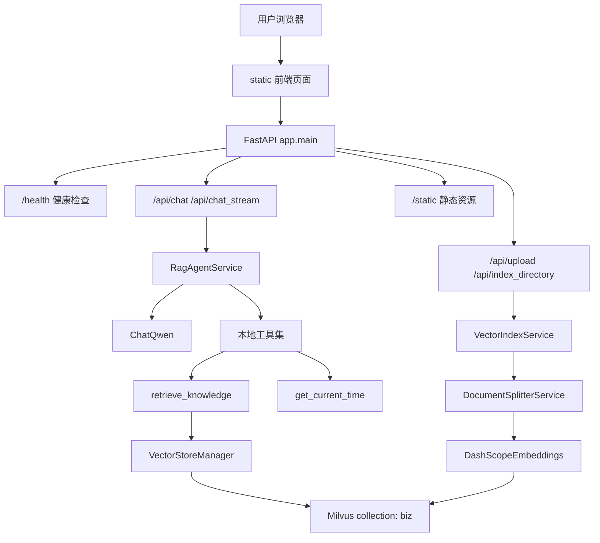
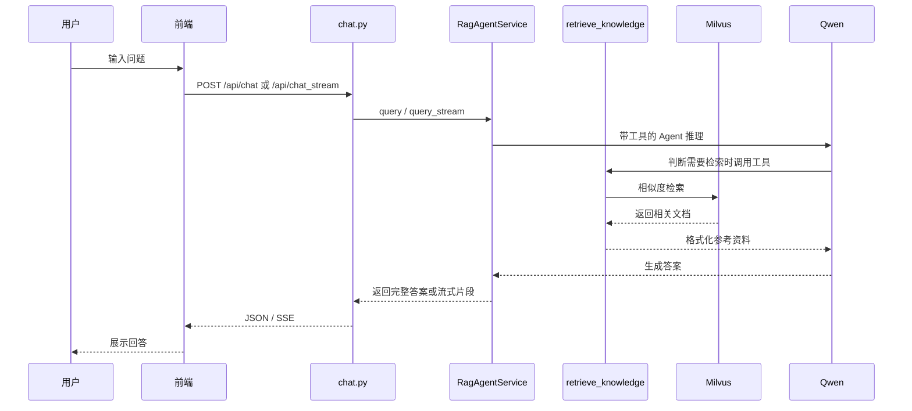

# AVF 科研助手技术文档

> 版本：v2.0.0  
> 日期：2026-07-08  
> 项目定位：面向动静脉瘘（AVF）狭窄方向的本地科研 RAG 问答助手

---

## 1. 项目概述

本项目是一个基于 FastAPI、LangChain、LangGraph、DashScope/Qwen 和 Milvus 的科研问答系统。当前版本已经移除原有运维 Agent / AIOps 诊断链路，保留并强化了面向 AVF 论文知识库的 RAG 问答能力。

系统主要能力包括：

- 基于知识库的科研问答
- 支持普通回答和 SSE 流式回答
- 支持 Markdown / TXT 文档上传并自动向量化入库
- 基于 Milvus 的语义检索
- 基于 DashScope/Qwen 的对话生成与文本向量化
- 浏览器端聊天界面与本地历史记录

当前项目可以理解为：

```text
AVF 论文资料 + 文档上传
        ↓
文本切块 + Embedding + Milvus
        ↓
知识检索工具 retrieve_knowledge
        ↓
LangChain Agent + Qwen
        ↓
科研问答 / 流式输出
```

---

## 2. 技术栈

| 层级 | 技术 | 说明 |
|---|---|---|
| Web 后端 | FastAPI | 提供 API、静态文件服务、生命周期管理 |
| 前端 | 原生 HTML / CSS / JavaScript | 聊天 UI、文件上传、流式响应解析 |
| Agent 框架 | LangChain | 创建可调用工具的对话 Agent |
| 会话状态 | LangGraph MemorySaver | 使用 `thread_id` 保存会话上下文 |
| 大模型 | DashScope / Qwen | 当前默认 `qwen-max` |
| Embedding | DashScope `text-embedding-v4` | 生成 1024 维向量 |
| 向量数据库 | Milvus | collection 名为 `biz` |
| 日志 | Loguru | 控制台与文件日志 |
| 配置管理 | Pydantic Settings | 从 `.env` 读取配置 |
| 容器 | Docker Compose | 启动 Milvus、etcd、MinIO |

---

## 3. 当前总体架构



---

## 4. 目录结构说明

```text
app/
  main.py                         FastAPI 应用入口
  config.py                       全局配置读取

  api/
    health.py                     健康检查接口
    chat.py                       普通问答、流式问答、会话管理接口
    file.py                       文件上传与目录索引接口

  services/
    rag_agent_service.py          RAG Agent 核心服务
    document_splitter_service.py  Markdown / 文本切块服务
    vector_embedding_service.py   DashScope Embedding 封装
    vector_index_service.py       文档读取、切块、入库编排
    vector_search_service.py      Milvus 原生搜索封装
    vector_store_manager.py       LangChain Milvus VectorStore 管理

  tools/
    knowledge_tool.py             知识库检索工具
    time_tool.py                  当前时间工具
    __init__.py                   默认工具集 DEFAULT_LOCAL_AGENT_TOOLS

  core/
    milvus_client.py              Milvus 连接、collection、索引管理
    llm_factory.py                ChatOpenAI 兼容模式工厂，当前较少使用

  models/
    request.py                    请求模型
    response.py                   响应模型
    document.py                   文档相关模型

  agent/
    mcp_client.py                 MCP 客户端预留封装，当前默认不启用外部服务

  utils/
    logger.py                     Loguru 日志配置

static/
  index.html                      前端页面
  app.js                          前端交互逻辑
  styles.css                      前端样式

aiops-docs/                       预置论文知识库文档
uploads/                          用户上传文件目录
docs/                             项目文档
vector-database.yml               Milvus Docker Compose 配置
Makefile                          Linux/macOS 常用任务
start-windows.bat                 Windows 启动脚本
run_server.py                     Windows 代理环境下的服务启动脚本
```

说明：目录名 `aiops-docs` 是历史遗留名称，当前实际用途是 AVF 科研知识库文档目录。

---

## 5. 后端启动与生命周期

入口文件为 `app/main.py`。

启动时执行：

1. 创建 FastAPI 应用
2. 注册 CORS
3. 注册路由：
   - `health.router`
   - `chat.router`
   - `file.router`
4. 挂载 `static/`
5. 在 lifespan 中连接 Milvus

关闭时执行：

1. 释放 Milvus collection
2. 断开 Milvus 连接

当前后端不再注册 `/api/aiops`，也不再依赖 `app.agent.aiops` 或 `app.services.aiops_service`。

---

## 6. API 接口

### 6.1 健康检查

```http
GET /health
```

用途：

- 检查 FastAPI 服务是否正常
- 检查 Milvus 是否 connected

典型响应：

```json
{
  "code": 200,
  "message": "服务运行正常",
  "data": {
    "service": "AVF-Research-Assistant",
    "version": "2.0.0",
    "status": "healthy",
    "milvus": {
      "status": "connected",
      "message": "Milvus 连接正常"
    }
  }
}
```

### 6.2 普通问答

```http
POST /api/chat
Content-Type: application/json
```

请求体：

```json
{
  "Id": "session-123",
  "Question": "AVF 狭窄有哪些常见检测方法？"
}
```

处理链路：

```text
chat.py
  → rag_agent_service.query()
  → LangChain Agent
  → retrieve_knowledge / get_current_time
  → ChatQwen
  → 返回完整答案
```

### 6.3 流式问答

```http
POST /api/chat_stream
Content-Type: application/json
```

请求体同 `/api/chat`。

返回格式为 SSE：

```text
event: message
data: {"type":"content","data":"..."}

event: message
data: {"type":"done","data":null}
```

前端通过 `ReadableStream` 读取响应体并逐行解析 SSE 数据。

### 6.4 清空会话

```http
POST /api/chat/clear
Content-Type: application/json
```

请求体：

```json
{
  "sessionId": "session-123"
}
```

用途：删除 MemorySaver 中对应 `thread_id` 的会话历史。

### 6.5 查询会话历史

```http
GET /api/chat/session/{session_id}
```

用途：从后端 MemorySaver 中读取指定会话历史。前端也会在 localStorage 中保存一份本地历史记录。

### 6.6 文件上传并入库

```http
POST /api/upload
Content-Type: multipart/form-data
```

字段：

```text
file: 上传文件
```

限制：

- 文件格式：`.txt`、`.md`
- 最大大小：10MB
- 保存目录：`uploads/`
- 同名文件会覆盖旧文件

处理链路：

```text
file.py
  → 保存文件到 uploads/
  → vector_index_service.index_single_file()
  → document_splitter_service.split_document()
  → vector_store_manager.delete_by_source()
  → vector_store_manager.add_documents()
  → DashScope Embedding
  → Milvus collection: biz
```

### 6.7 索引目录

```http
POST /api/index_directory
```

可选参数：

```text
directory_path
```

如果不传，默认索引 `uploads/` 下所有 `.txt` 和 `.md` 文件。

---

## 7. RAG 问答流程



RAG Agent 当前默认工具集位于 `app/tools/__init__.py`：

```python
DEFAULT_LOCAL_AGENT_TOOLS = (
    retrieve_knowledge,
    get_current_time,
)
```

其中：

- `retrieve_knowledge`：从 Milvus 中检索相关文档片段，并按文件名去重
- `get_current_time`：返回指定时区当前时间

---

## 8. 文档入库流程

### 8.1 文件保存

上传接口会先做校验：

- 文件名不能为空
- 后缀必须是 `txt` 或 `md`
- 文件大小不能超过 10MB
- 文件名会替换空格和特殊路径字符

### 8.2 文档切块

`DocumentSplitterService` 会根据文件类型选择切块策略：

- `.md`：先按 Markdown 标题切分，再用递归字符切分器二次切分
- `.txt`：直接使用递归字符切分器

切块元数据包括：

- `_source`：文件路径
- `_extension`：扩展名
- `_file_name`：文件名
- Markdown 标题字段：如 `h1`、`h2`

### 8.3 向量化与写入 Milvus

`DashScopeEmbeddings` 实现了 LangChain 标准 `Embeddings` 接口：

- `embed_documents(texts)`
- `embed_query(text)`

Milvus collection 由 `MilvusClientManager` 创建和维护：

| 字段 | 类型 | 说明 |
|---|---|---|
| `id` | VARCHAR | 主键，自定义 UUID |
| `vector` | FLOAT_VECTOR | 1024 维向量 |
| `content` | VARCHAR | 文档分片内容 |
| `metadata` | JSON | 来源文件、标题等元数据 |

索引配置：

```text
metric_type = L2
index_type  = IVF_FLAT
nlist       = 128
```

---

## 9. 前端说明

前端由 `static/index.html`、`static/app.js`、`static/styles.css` 构成。

主要功能：

- 新建对话
- 快速问答
- 流式问答
- 文件上传
- 历史对话本地保存
- Markdown 渲染
- 代码高亮

前端状态主要保存在 `AVFResearchApp` 类中：

| 字段 | 说明 |
|---|---|
| `apiBaseUrl` | API 基础地址，默认 `http://localhost:9900/api` |
| `currentMode` | `quick` 或 `stream` |
| `sessionId` | 当前会话 ID |
| `isStreaming` | 是否正在等待响应 |
| `currentChatHistory` | 当前对话消息 |
| `chatHistories` | localStorage 中的历史对话 |

上传限制已与后端保持一致：

- `.txt`
- `.md`
- 10MB

---

## 10. 配置说明

配置类位于 `app/config.py`，通过 `.env` 加载。

常用配置：

```bash
APP_NAME=AVF-Research-Assistant
DEBUG=True
HOST=0.0.0.0
PORT=9900

DASHSCOPE_API_KEY=你的 DashScope Key
DASHSCOPE_MODEL=qwen-max
DASHSCOPE_EMBEDDING_MODEL=text-embedding-v4

MILVUS_HOST=localhost
MILVUS_PORT=19530
MILVUS_TIMEOUT=10000

RAG_TOP_K=5
CHUNK_MAX_SIZE=800
CHUNK_OVERLAP=100
```

注意：

- 不要把真实 API Key 提交到公开仓库。
- DashScope Embedding 当前固定使用 1024 维。
- 如果 Milvus 已存在 collection 但向量维度不匹配，启动时会删除并重建 collection。

---

## 11. 运行方式

### 11.1 Windows

推荐使用：

```powershell
.\start-windows.bat
```

或手动运行：

```powershell
docker compose -f vector-database.yml up -d etcd minio standalone
python run_server.py
```

访问：

```text
Web 页面: http://localhost:9900
API 文档: http://localhost:9900/docs
健康检查: http://localhost:9900/health
```

### 11.2 Linux / macOS

```bash
make up
make start
make check
```

当前 `make start` 只启动 FastAPI 服务，不再启动运维 MCP 示例服务。

---

## 12. 日志

日志配置位于 `app/utils/logger.py`。

输出位置：

```text
logs/app_YYYY-MM-DD.log
```

特性：

- 按天轮转
- 保留最近 7 天
- 自动压缩旧日志
- 控制台输出根据 `DEBUG` 调整级别

Windows 控制台如果使用 GBK 编码，部分 emoji 日志可能显示异常，但不影响服务运行。

---

## 13. 扩展建议

### 13.1 增加 PubMed / Semantic Scholar 检索

可以新增工具：

```text
app/tools/paper_search_tool.py
```

然后在 `app/tools/__init__.py` 中加入默认工具集：

```python
DEFAULT_LOCAL_AGENT_TOOLS = (
    retrieve_knowledge,
    search_papers,
    get_current_time,
)
```

### 13.2 增加引用来源展示

当前 `retrieve_knowledge` 会把来源和内容格式化给模型，但前端没有单独展示引用卡片。后续可以让 `/api/chat_stream` 返回 `search_results` 类型事件，用于前端展示“参考论文列表”。

### 13.3 增加持久化会话

当前后端会话使用 `MemorySaver`，服务重启后会丢失。可以替换为：

- SQLite
- PostgreSQL
- Redis
- LangGraph 持久化 checkpointer

### 13.4 增加测试

当前仓库未看到测试目录。建议补充：

- `test_health.py`
- `test_file_upload.py`
- `test_document_splitter.py`
- `test_knowledge_tool.py`

---

## 14. 已知注意事项

1. `.env` 中不能使用 `;` 作为注释，Docker Compose 只识别 `#`。
2. 上传文件后如果索引失败，接口仍可能返回上传成功，需要看日志确认索引状态。
3. Milvus collection 名固定为 `biz`，切换业务时要注意数据混用。
4. `run_server.py` 会设置本机代理环境变量，适用于当前 Windows 代理网络环境；其他机器可能需要调整。
5. 文档目录 `aiops-docs` 是历史名称，可以后续重命名为 `knowledge-docs` 或 `avf-docs`。

---

## 15. 维护检查清单

修改代码后建议执行：

```powershell
python -c "import ast,pathlib; files=list(pathlib.Path('app').rglob('*.py')); [ast.parse(p.read_text(encoding='utf-8'), filename=str(p)) for p in files]; print(f'AST OK: {len(files)} files')"
node --check static\app.js
```

服务启动后检查：

```powershell
curl http://localhost:9900/health
```

预期结果：

```text
status = healthy
milvus.status = connected
```

